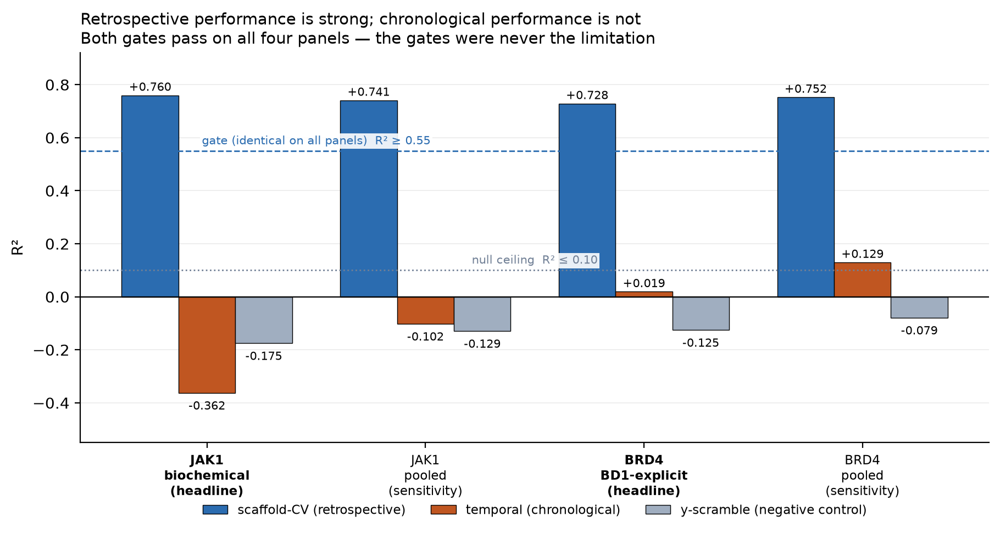
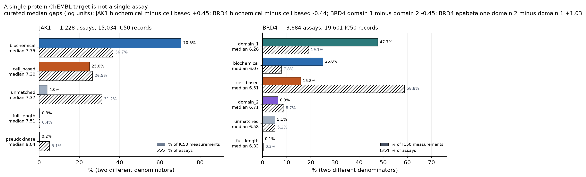
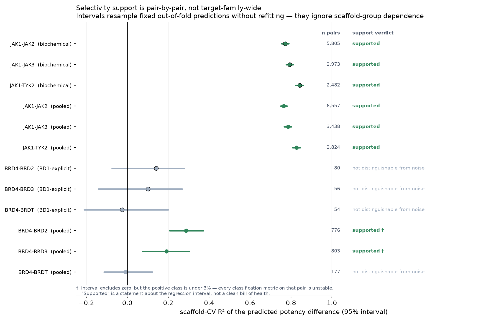

# medchem-hit-pipeline

A reproducible, configuration-driven pipeline for **computational hit finding across protein targets**.
It accepts a target definition, curated public activity data, optional structural inputs, and
campaign-specific priors; standardises assay data; builds and challenges potency and selectivity models;
supports virtual screening; prepares receptor and input artifacts and provides interfaces and harnesses
for external structure-based execution; and defines the interfaces a generative backend would implement.

**Implementation status.** The pipeline is a branching graph of composable stages. The stages are not all
exercised to the same depth, and that distinction matters more than the breadth:

| capability | status |
|---|---|
| Acquisition → gated evaluation | **reproduced** for JAK1 and BRD4 |
| Retargeting by configuration | **demonstrated** across a kinase and a bromodomain, within the limits below |
| Receptor preparation | **implemented** as an independent stage. **No exact receptor artifact is evidenced or published for the frozen panels**: the records previously resolved one by modification time, which cannot attribute it to a given panel's run, so the claim is withdrawn rather than restated. Nothing downstream consumes it here |
| Virtual screening (VLS) | **implemented**, enabled in the JAK1 configuration, and implementation-tested. **No campaign VLS result or screening library is included in this release**; `enabled: false` for BRD4 |
| Docking | a **callable subprocess docking harness exists** (`medchem.structure.dock`) — it shells out to an engine with a **Vina-compatible command line and score table** (`--receptor/--ligand/--center_*/--size_*/--exhaustiveness`, best-mode score parsed from stdout), parallelises across ligands, and reason-codes every outcome so a technical failure is never counted as a non-binder. Vina, smina, gnina and Uni-Dock fit that interface; an engine with a different one does not. But **no registered pipeline stage invokes it, no engine is bundled, and no published result uses it** — it is library code with a documented protocol, and integration and orchestration are the caller's |
| Generative design | **CPU replay-and-score implemented** and tested. The production REINVENT sampler and the Boltz-2 scorer are **stubs/interfaces requiring an external implementation — the shipped methods raise** |
| Experimental validation | **outside this repository** |

> **No candidate nominated by this pipeline was synthesised or experimentally tested as part of this
> work.** The model *inputs* are public experimental ChEMBL measurements; the *outputs* are computational.
> The headline scientific finding is a **negative** one: the models do not generalise forward in time.

---

## What it accepts as input

| input | required | form |
|---|---|---|
| **Target definition** | yes | a primary target and any comparators, as **ChEMBL target identifiers**, in one YAML config |
| **Activity data** | yes | retrieved from the ChEMBL REST API by those identifiers, **or** restored from the prescribed frozen-snapshot format (checksum-verified, offline) |
| **Assay-cohort policy** | yes | one of the **versioned cohort specifications** the package defines, named in the config |
| **Structural inputs** | optional | a reference PDB entry and ligand for the receptor arm |
| **Campaign priors** | optional | screening library, known reference ligand, gate thresholds, temporal cutoff, seed |

**Scope of the data layer, stated precisely.** Acquisition is ChEMBL-identifier based, plus the frozen
snapshot restore path. It is **not** a general ingestion layer: using activity data from another source
means writing an acquisition path that emits the **raw activity and assay-metadata schema that curation
expects** — per-measurement rows with the activity value, units and relation, the assay identifier and
document year, plus the assay-metadata table curation joins for cohort classification. Producing
already-curated columns is not sufficient, because cohort selection reads assay metadata.

## Stage graph

The graph below is the one the stage decorators declare. `evaluate`, `vls` and `generative` are
**siblings** off `qsar`: evaluation produces the gated metrics, and it neither precedes nor blocks the
screening and generative branches.

| stage | depends on | optional input |
|---|---|---|
| `data_pull` | — | |
| `curate` | `data_pull` | |
| `featurize` | `curate` | |
| `qsar` | `featurize` | |
| `selectivity` | `curate` | |
| `evaluate` | `featurize`, `qsar` | |
| `vls` | `curate`, `featurize`, `qsar` | `selectivity` |
| `generative` | `curate`, `featurize`, `qsar` | `selectivity` |
| `receptor` | — (independent; needs a reference structure, not features) | |

```
                                     +--> evaluate      gated metrics; the four frozen panels
                                     |
  data_pull --> curate --> featurize --> qsar --+--> vls          optional arm
                    |                            |
                    |                            +--> generative  optional arm
                    |
                    +--> selectivity        optional input to vls and generative

  receptor      independent of the chain above

  OUTSIDE the registered graph:   docking execution   |   experimental testing
```

Experimental testing is outside this repository. Docking execution is not a registered graph stage: a
callable subprocess harness exists, but no registered stage invokes it and no published result uses it.

**Stage caching.** Each *stage* has a cache key derived from its own source, the configuration keys it
declares, and the keys of its upstream stages; a stage re-runs when its key changes and otherwise resolves
from cache. The edges above are dependency relations, not cached objects. Optional arms are declared in
configuration — the VLS arm additionally requires a library the stage can find — and the stages that
declare an optional input take their optional path when it is absent rather than scoring against nothing.

The four frozen result panels are produced by the `data_pull → curate → featurize → qsar → evaluate`
path together with `selectivity`. No `vls`, `generative`, `receptor`-derived or docking output contributes
to any published number.

## Applying it to a new target

Everything a new campaign changes lives in one config file, and there is no new code path for a new
protein **provided two conditions hold**:

1. the target's data is reachable as **ChEMBL identifiers** (or you supply an equivalent frozen snapshot); and
2. one of the **existing versioned cohort specifications** expresses the assay policy you need.

Outside those conditions, retargeting is not configuration-only: a different acquisition source needs an
acquisition path, and a genuinely new assay policy needs a new cohort specification in
`medchem.cohorts` — which is code, deliberately, because a cohort is a scientific claim about which
measurements are comparable and is versioned so results stay attributable to it.

**In-package controls** — read by a stage and affecting what it computes:

| control | effect |
|---|---|
| `target`, `seed` | campaign name; seeding for the model fits |
| `data.targets`, `data.primary` | which ChEMBL targets are pulled, and which is primary |
| `data.activity_types` | which activity endpoints are accepted |
| `curation.assay_cohort` | which versioned cohort specification admits assays |
| `curation.temporal_cutoff_year` | the year at which era-split labels are built |
| `features.radius`, `n_bits`, `use_chirality`, `descriptors` | Morgan fingerprint geometry and the descriptor block. Omitting `descriptors` selects the standard nine; `descriptors: []` means no descriptor columns, and the two are kept distinct |
| `model.potency.rf_n_estimators`, `model.potency.xgb` | the potency models. `xgb` accepts exactly the five parameters `qsar` forwards — a key XGBoost itself would accept but this pipeline does not pass is rejected, not dropped |
| `model.selectivity.pairs` | which comparator pairs are attempted (validated against `data.targets`). Omitting it derives every primary–comparator pair; `pairs: []` asks for no selectivity modelling |
| `eval.temporal_cutoff_year` | the year at which the evaluation splits rows |
| `eval.gates` | the pass/fail thresholds. `leakage_max_exact_dupes` is optional and off by default |
| `structure.*` | reference entry, ligand, box, protonation for the receptor arm |
| `vls.enabled`, `vls.library` | whether the screening arm runs, and against what |
| `vls.tier1` | applicability-domain and prioritisation thresholds. `conformal_halfwidth` unset takes this run's measured value; `0.0` is a request for no uncertainty band, not a synonym for unset |
| `disable_stages` | stages left out of the graph. A name that is not a stage of the pipeline is rejected — it disabled nothing and said so nowhere |

**Fixed implementation choices.** These fields exist and are validated, but each is constrained to the
single value the code implements, so they record a decision rather than offer a choice — and a config
asking for anything else is **rejected** rather than silently given the default:

| field | fixed to | what is fixed |
|---|---|---|
| `data.standardize_units_to` | `pIC50` | conversion from `standard_units`; never trusted from a label |
| `data.dedup` | `median` | replicate measurements aggregate by median |
| `features.fingerprint` | `ecfp4` | Morgan/ECFP4; the geometry keys above *are* honoured |
| `eval.splits` | `random`, `scaffold`, `temporal` | the harness computes all three unconditionally |
| `model.selectivity.mode` | `direct_delta` | the Δ is predicted directly, not by subtracting two potency models |

Constraining them is the point: each was previously accepted and then ignored, so a config could ask for
mean aggregation or a different fingerprint family and receive the default with no warning.

**External campaign declarations.** The remaining `vls` keys — tier definitions, engines, budget
allocation, validation and prospective blocks — are a campaign *specification* for execution this
repository does not perform. They are declarative records, not controls the shipped stages act on.

All four frozen configurations declare **identical gate thresholds**, which is what makes the
cross-family comparison a controlled one. Retuning the gates per target would be a configuration change
rather than a code change — it would weaken the comparison, not contradict the claim that retargeting is
configuration-driven.

## Stage status

"Reusable" means the stage is driven by configuration and needs no new code for a different protein,
subject to the two conditions above.

| stage | JAK1 | BRD4 | reusable for a new target |
|---|---|---|---|
| `data_pull` | run | run | yes, for a ChEMBL-reachable target |
| `curate` | run | run | yes, under an existing versioned cohort specification |
| `featurize` | run | run | yes |
| `qsar` | run | run | yes |
| `selectivity` | run — 3/3 pairs supported, model written | run — **headline cohort 0/3 supported, no model written**; **pooled sensitivity cohort 2/3 supported, model written** | yes — comparators are configuration |
| `evaluate` | run | run | yes — gates are configuration |
| `receptor` | implemented; no exact artifact evidenced for this release | implemented; no exact artifact evidenced for this release | yes, given a reference PDB entry |
| `vls` | implemented; `enabled: true`; implementation-tested. **No campaign result or library ships** | `enabled: false` | yes, given a library the stage can find |
| docking | no registered stage | no registered stage | a protocol and a subprocess harness for a **Vina-compatible** engine (Vina/smina/gnina/Uni-Dock); nothing bundled |
| `generative` | CPU replay-and-score implemented and tested; production sampler is a raising stub | same | interface is reusable |

`MockSampler` replays a fixed candidate pool deterministically and the multi-objective scoring runs on
CPU, so the generative path is implemented and tested end to end on CPU. `Reinvent4Sampler` and
`Boltz2Scorer` are **interfaces whose shipped methods raise**: they require an external implementation
this repository does not provide. No frozen result depends on either.

---

## JAK1 and BRD4 as validation cases

The two targets are here to test the pipeline, not the other way round. A kinase and a bromodomain differ
in binding-site chemistry, comparator families and data density, so running the same graph over both
under identical gate thresholds tests whether the workflow is genuinely target-agnostic — and whether it
reports its own failures.

It does report them. What follows is the frozen evidence: strong retrospective performance, a **negative**
chronological result on both targets, and a selectivity analysis that declined to produce a BRD4 model in
the headline cohort because no comparator pair met its support criteria.

---

## Validation-case results

**The model:** a RandomForest (400 trees) on chiral ECFP4 fingerprints plus 9 RDKit descriptors,
regressing **pIC50** — one median value per compound from curated ChEMBL IC50 records. Identical
featurisation and hyperparameters on both targets, deliberately: retuning per target would weaken the
controlled cross-target comparison, since a difference in outcome could then be a difference in tuning. XGBoost is trained alongside and agrees to within ~0.01 R².

**The evaluation:** Bemis–Murcko **scaffold-grouped** 5-fold CV is the reported metric, with a
chronological split (train pre-2022, test 2022-onward) and a y-scrambled null as controls. Two
pass/fail gates, holding the **same two thresholds in all four panels** and the same thresholds on both
sides of the cohort correction — checkable from `configs/` and from each manifest's `gates` block.
Headline and sensitivity runs provably consumed byte-identical inputs.

| | JAK1 headline<br>biochemical | JAK1 sensitivity<br>pooled | BRD4 headline<br>BD1-explicit, structured<br>single-protein binding IC50 | BRD4 sensitivity<br>pooled |
|---|---|---|---|---|
| compounds | 6,894 | 7,912 | 2,794 | 7,955 |
| **scaffold-CV R²** *(gate ≥ 0.55)* | **0.760** | 0.741 | **0.728** | 0.752 |
| **temporal R²** *(2022 cutoff)* | **−0.362** | −0.102 | **+0.019** | +0.130 |
| y-scramble R² *(gate ≤ 0.10)* | −0.175 | −0.129 | −0.125 | −0.079 |
| selectivity pairs supported | 3 / 3 | 3 / 3 | **0 / 3** | 2 / 3 |
| gate | pass | pass | pass | pass |



### The finding that matters

**Retrospective generalisation is strong. Chronological generalisation is not.**

Scaffold-CV R² of 0.76 and 0.73 on a kinase and a bromodomain. Split the same data by publication year
instead, train only on pre-2022 labels, and JAK1 falls to **−0.362** — worse than predicting the mean.
BRD4 reaches **+0.019**, which is indistinguishable from nothing.

Both gates passed on all four panels. The gates were never the limitation.

> **These models support computational prioritisation within represented chemical space. They do not
> establish reliable prospective activity prediction.** That is the ceiling on every compound this
> pipeline emits.

Scaffold overlap belongs to the **random** split, not the temporal one. The random 80/20 test sets
share **66.0–76.8%** of their scaffolds with training, which is why that split is never reported as a
headline. The temporal test sets share only **5.0–12.1%**, so the chronological split is already close
to scaffold-disjoint and its negative R² cannot be explained away by shared scaffolds — it is a harder
test than the random split, and it is the one that fails. Measured by
[`scripts/derive_temporal_overlap.py`](scripts/derive_temporal_overlap.py) into
`provenance/<panel>/temporal_overlap.json`; the evaluation harness itself reports only the random-split
figure.

---

## A single-protein target is not a single assay

This is the finding the cohort machinery exists for. "BRD4 IC50" is not one measurement — it is a
mixture of assays that disagree with each other:



BRD4's IC50 **records** are 47.7% first-bromodomain, 25.0% biochemical with no domain stated, 15.8%
cell-based and 6.3% second-bromodomain. Counted by **assay** instead, cell-based is 58.8% — the two
denominators differ by more than 3× because cell assays are numerous and small. One phase-3 reference
compound, apabetalone, reads **5.85** on the first domain against **6.88** on the second: same molecule,
same protein, 1.03 log units apart. A median across both represents neither.

So cohorts are a versioned part of the specification (`src/medchem/cohorts.py`, **spec 1.2**), and every run
records the exact assay IDs it admitted and excluded, each with its own exclusion reason. Each target is
analysed twice: a **headline** cohort with one assay definition, and a **pooled sensitivity** cohort that
keeps everything.

The BRD4 headline cohort is the **BD1-explicit, structured single-protein binding IC50 cohort**, and the two
halves of that name come from different places. **Domain identity is still read from the assay
description** — ChEMBL's structured fields do not encode which bromodomain was measured, so nothing here
confirms BD1 independently. What the structured fields *do* confirm is the **assay format**: a
single-protein BAO format and a binding assay type. On top of that, any description naming a
tandem-domain construct is excluded, and ambiguous or conflicting metadata is excluded rather than
admitted. That matters because the earlier
text-only definition admitted 23 assays naming *both* bromodomains — `BD1/BD2` contains `BD1` — plus one
cell-based reporter assay and 172 assays carrying only the root "assay format" term, which asserts
nothing. Positive confirmation, not absence of a disqualifier.

Restricting the cohort **improved** JAK1's scaffold-CV (0.741 → 0.760, on 13% fewer compounds) and
**reduced** BRD4's (0.752 → 0.728, on 65% fewer). Temporal performance was **lower** for JAK1 and
essentially unchanged for BRD4.

> That comparison **cannot isolate assay heterogeneity from sample size, chemical space, or time
> distribution** — the two runs differ in their training *and* evaluation populations. The direction is
> observed, not explained.

Every composition figure above is derived by
[`scripts/derive_composition.py`](scripts/derive_composition.py) from the published input bytes and
asserted against the provenance records in CI. The classification rules are evaluated in a fixed
precedence — `cell_based` ahead of domain — so a figure quoted from any other rule ordering would not
match, which is why these are derived rather than transcribed.

---

## Selectivity: no supported BET pair in the headline cohort, and therefore no model

On the BD1-explicit, structured single-protein binding IC50 panel, **none of the three BET pairs is distinguishable from noise**:

| pair | n | R² | 95% CI | verdict |
|---|---|---|---|---|
| BRD4–BRD2 | 80 | +0.142 | [−0.075, 0.277] | spans zero |
| BRD4–BRD3 | 56 | +0.102 | [−0.141, 0.269] | spans zero |
| BRD4–BRDT | 54 | −0.026 | [−0.210, 0.200] | spans zero |



**So no selectivity model was written for the headline cohort.** `production_model.written: false` — the downstream screening
and generative stages take their optional-selectivity path rather than scoring against noise. That is the
pipeline behaving as designed on a negative result, not a failure to produce one.

**The cohort specification decides this outcome, and that is worth seeing directly.** Under a text-only
cohort — admitting any assay whose description names the domain — BRD4–BRD2 reaches n = 132 with
R² 0.208, CI [0.053, 0.339], which reads as a partial selectivity model. Requiring BD1-explicit assays
with a structured single-protein binding format takes the same pair to n = 80 with its interval spanning
zero. The looser definition's apparent support rests on measurements a domain-resolved cohort does not
admit — which is why the cohort is a named, versioned specification recorded in every manifest rather
than a filter applied in passing.

JAK1's three pairs remain supported and strong (R² 0.77–0.84), which is what makes this result
informative rather than merely disappointing: the same method, the same gates, a different answer.

To be exact about the scope: **this is a statement about the headline BD1-explicit cohort, not about the
BET family.** The pooled `target_associated` sensitivity panel supports 2 of 3 pairs and does write a
production model. Which of the two is right is the point of the comparison — the pooled panel mixes BD1,
BD2, cell-based and full-length measurements, so its support rests partly on rows a domain-resolved
question does not admit — but "no BET pair is supported" is a claim about a cohort, and stating it
without the cohort would overstate it. The
reason is visible in the attrition — domain-matching costs the comparators 79% (BRD2), 88% (BRD3) and
63% (BRDT) of their compounds, leaving panels of 80, 56 and 54 paired measurements.

"Supported" would mean a **positive but uncertain cross-validated estimate** — the intervals resample
fixed out-of-fold predictions without refitting and ignore scaffold-group dependence, so they are
optimistic about their own width. In the pooled sensitivity cohort two pairs do qualify, but with
positive classes of 2.2% and 1.4%, where every classification metric is unstable. That result belongs to
the sensitivity analysis only.

---

## What this is and is not

**Is:** a reproducible pipeline; an evaluation with declared thresholds that was allowed to fail; an honest account
of where public bioactivity data does and does not support the questions asked of it.

**Is not:** validated hits. No candidate this pipeline nominates was synthesised or experimentally
tested as part of this work — the ChEMBL inputs are public experimental measurements, the outputs are
not. Every compound the pipeline would emit is a computational hypothesis, and the temporal results above
are the reason to say so plainly.

**Not a prospective predictor.** See the limitation above; it is the headline finding, not a caveat.

---

## Reproducing this

Install first. `uv run` will otherwise build a bare environment and the pipeline will fail on a missing
scientific dependency — the extras are not optional for anything below:

```bash
uv sync --extra science --extra dev --extra docking --frozen
uv run ruff check . && uv run pyright && uv run python -m pytest tests/ -q
uv run python scripts/verify_docs_against_manifests.py   # every documented number vs provenance/
uv run python scripts/make_frozen_figures.py --check     # figures match the records they depict
uv run python scripts/publish_snapshots.py --check       # 16 snapshot checksums
uv run python scripts/check_no_leaks.py --ci             # publication hygiene, runner mode
```

CI runs **one command** — `bash scripts/gate.sh --ci` — so there is a single definition of "the checks
pass" and no second list to drift out of step with it. The block above is a readable subset of what that
gate runs, in roughly its order; run the gate itself to reproduce CI exactly:

```bash
bash scripts/gate.sh --ci
```

The difference between the two modes is the leak scan. `--ci` runs it in runner mode; the default
developer mode additionally requires a repository-local noreply git identity, so that a commit made here
cannot inherit a global one. A reader who has just cloned has not set one, and would see that as a
failure of the repository rather than of their git config — hence `--ci` in the reader-facing path.

**The exact metrics.** The ChEMBL records the results were computed from are published in
[`data/frozen_snapshots/`](data/frozen_snapshots/) (2.7 MB gzipped, CC BY-SA 3.0). Checksums are verified
on restore, and the stages that produce the numbers use **no network**:

```bash
export MEDCHEM_FROZEN_SNAPSHOT=data/frozen_snapshots
for c in jak1 jak1_sensitivity brd4 brd4_sensitivity; do
  uv run medchem run -p discovery -c "configs/$c.yaml" \
    --stage data_pull --stage curate --stage featurize \
    --stage qsar --stage selectivity --stage evaluate
done
```

**The stage list is load-bearing.** Running the full graph instead also executes `receptor`, which
**fetches a structure from the RCSB PDB**. Two network dependencies, and they apply in different
situations: `data_pull` queries ChEMBL and so needs network **whenever the frozen snapshot is not
restored**, and `receptor` needs it **even when the snapshot is restored** — it is the additional
dependency that makes the full graph non-offline. So "no network" is true of the six metric-producing
stages WITH `MEDCHEM_FROZEN_SNAPSHOT` set, and false of the whole graph in either situation.

All four panels in the table above, in that order. Each writes an `eval_report.json` whose metrics should
match `provenance/<panel>/eval_report.json`.

**Expected agreement is a tolerance, not a bit pattern.** Float64 results vary in their last bits with the
BLAS kernel, the thread count and the CPU, which is not a property this pipeline can fix. Treat agreement
to **1 × 10⁻¹²** as reproduced for every metric this documentation reports, and expect the selectivity
support verdicts and the production-model decision to match exactly, because those are threshold
comparisons rather than raw floats. Running one config reproduces one column.

To be clear about where that bound comes from, because it is easy to overstate: **no independent
reproduction of these panels on other hardware has been performed**, and none is recorded here. The
measurement behind the bound is a same-machine cache-free re-run, reported below and in
[`provenance/REPRODUCTION_RUN.json`](provenance/REPRODUCTION_RUN.json), whose largest continuous
difference was 1.8 × 10⁻¹⁵. The 10⁻¹² bar sits about three orders of magnitude above that, as headroom for
the cross-machine variation described in the first sentence — variation this repository has not itself
measured. If you reproduce these panels elsewhere and see something different, that is new information,
not a contradiction of a measurement made here.

**One family of values in the provenance records is looser, and 10⁻¹² is the wrong bar for it.** The
`roc_auc`, `pr_auc` and `pr_auc_lift_over_baseline` entries inside
[`provenance/<panel>/selectivity_metrics.json`](provenance/) are **rank** statistics, and they sit on top
of `RandomForestRegressor(n_jobs=-1)`. Scikit-learn's parallel prediction accumulates each tree's output
into a shared array in whatever order the threads finish, so repeated `predict()` calls on one fitted
model are **not bitwise identical** — measured here at up to 1.3 × 10⁻¹⁵. A shift that small cannot move a
continuous metric appreciably, but it can swap two near-tied predictions, and a rank statistic then moves
by one discrete quantum.

Re-running the frozen panels on the same machine measured exactly that. Across all **8** compared
artifacts — four `eval_report.json` and four `selectivity_metrics.json`, about 600 leaf values — the
largest continuous difference was **1.8 × 10⁻¹⁵** and the largest rank-statistic difference
**4.7 × 10⁻⁷**, with **zero** values outside their family's tolerance. The rank difference appears only in
the two JAK1 panels' selectivity records, those being the cohorts with near-tied predictions to swap;
every `eval_report.json` reproduced with no rank movement at all. So use **1 × 10⁻⁵** for those three
keys and 10⁻¹² for everything else.

That looser figure is an *observed* bound with headroom, not a derived limit, and four separate runs are
what let this document say so rather than merely assert it: the worst rank difference measured
**4.7 × 10⁻⁷**, **1.6 × 10⁻⁶**, **1.6 × 10⁻⁶** and **4.7 × 10⁻⁷** — a factor of three across runs of
source that computes identically. The four runs carry **different source digests** —
the record says so, and the difference is real: configuration validation, the VLS screen and the
generative harness changed between them. What did **not** change is anything the six metric-producing
stages read: their cache keys are derived from their own source and their declared configuration
subtrees, none of which those edits touch, which is why the metrics themselves reproduced. One discrete step of a rank
statistic is one near-tie swapping, and which near-ties swap varies between runs — so a single
measurement cannot tell an observed bound from a derived one, and the spread is the evidence. Both
measurements are in `provenance/REPRODUCTION_RUN.json`: the current run at the top, earlier ones under
`previous_runs`, each with the source digest it was measured at.

None of the affected values is quoted in this documentation; they exist only inside the provenance
records. Every support decision, support reason, paired count, supported-comparator list, basis column
and production-model decision was identical on all four panels, so no reported result and no conclusion
depends on the difference. To be exact about the scope: those are the decisions carried by the two
artifacts the comparison reads. Assay-level cohort exclusion reasons are recorded in
`run_manifest.json`, which is not among the eight compared, so their stability rests on the cohort rules
being versioned code — not on this comparison. Forcing
`n_jobs=1` would make them deterministic, at the cost of re-running four frozen panels to move numbers
that change nothing — a worse trade than stating the real bound.

The per-artifact figures are in [`provenance/REPRODUCTION_RUN.json`](provenance/REPRODUCTION_RUN.json),
which is **measured and not re-derivable**. Precisely what it holds, because "per-key deltas" overstated
it: the reference, rerun and published hash of every artifact; how many leaf keys were compared; the worst
continuous and worst rank difference **per artifact**; a `findings` list carrying the individual keys of
any value outside its tolerance, or missing, extra or non-finite — empty here, which is the result; the
support and production-model decisions from both sides; and the `[ran]`/`[cache]` counts measured from the
run logs. The reference it compares against was captured **before** any source edit in that pass and held
read-only outside the repository, so publishing cannot overwrite the yardstick.

**The workflow.** Without that variable the pipeline pulls live from ChEMBL. That reproduces the method
against current data and will **not** match the numbers above, because ChEMBL grows. That is the
expected outcome, not a failure.

Provenance records several separate identities, because no single git SHA identifies both the source that
produced a result and the tree that ships it — see
[`provenance/IDENTITY.json`](provenance/IDENTITY.json):

| record | what it is |
|---|---|
| **scientific-source digest** | a hash over the results-determining source and configuration — 37 modules and four semantically-hashed configs, NOT the repository. Recomputable from any tree, so it is the one to compare, and two trees that differ only in documentation, tests, scripts or comments share it. Its coverage is enumerated below rather than assumed |
| single-clean-revision attestation | a **Boolean** (`code.single_clean_revision`): every panel recorded the same source revision and none ran from a dirty tree. It is an attestation, **not** a revision identifier, and no identifier is published |
| content commit | the commit holding the content. A commit cannot contain its own SHA, so the value is recorded by the commit after it |
| tag | the tag applied to this tree, recorded separately from the commit it points at |
| manifest tool version | which generation of the provenance tooling wrote the records |

**What the digest covers.** It is computed over the import closure of the stage modules **plus** the
configuration layer and the runner and cache modules — **37 modules**. That covers the stages, the cohort
specification, the models, the features and the evaluation harness, and also the code that supplies
defaults, decides what executes, and decides what is reused from cache rather than recomputed. Those last
matter because a change there can alter a result without touching any stage.

**What it does not cover, enumerated rather than characterised.** The package holds 46 modules; the
closure is 37. The nine outside it are `medchem.cli`, `medchem.utils`, `medchem.loop`,
`medchem.provenance` and `medchem.provenance.resolve`, `medchem.structure.dock` and
`medchem.structure.prep`, `medchem.generative.active_learning`, and `medchem.generative.scorers` —
together with everything under `scripts/`. None of them is imported by a stage that produces a published
metric, which is the criterion; they are the CLI, the docking harness no registered stage invokes, the
active-learning interface nothing runs, and the tooling that writes and checks the records.

Two of those deserve naming rather than lumping. `medchem.structure.dock` is the Vina-compatible
harness — real code, no registered stage, no published output. `medchem.provenance.resolve` is used by
`publish_provenance.py` to decide WHICH artifact gets published: a change there could alter which file
is published without moving the digest at all. So the digest is not a hash of the repository, and it is
not a hash of the package either. It identifies the results-determining source and configuration, and
the rest is covered by the test suite and the gate.

The digest is scoped to one CPython minor version, because the AST normalisation it relies on differs
between them; the pinned interpreter is recorded alongside it.

**No module differs** between the source that produced the frozen results and this one. Precisely: the
records that ship were produced under the same results-determining source and configuration digest that
this tree computes. That is a narrower claim than "the same tree" — the documentation and the checking
tooling changed after the runs, as they had to — and it is the claim the digest actually supports. The four panels were
re-run cache-free at the same **results-determining source and configuration digest** this release ships —
`--force` into per-panel directories that did not previously exist — so `frozen_analysis_digest` equals the
release digest and `differs_by` is empty. Stated that way rather than "from this tree" because the two are
different claims: the Git tree at the moment of the rerun and the Git tree that ships are NOT identical,
and cannot be. Regenerating the provenance records, the figures and this document necessarily happens
after the run that produced them, and the fixes those documents describe land afterwards too. What the
digest pins is the 37 modules and four semantically-hashed configs; documentation, tests, scripts and
comments sit outside it by design, so they may differ while the digest does not. The measured evidence is in
[`provenance/REPRODUCTION_RUN.json`](provenance/REPRODUCTION_RUN.json): reference and rerun hashes per
artifact, the worst difference per artifact against each documented tolerance, the individual keys of
anything outside tolerance (none), the support and production-model decisions from both sides, and the
measured per-panel `[ran]`/`[cache]` counts.

A caveat on what a *reader* can check from this tree alone: `publish_provenance.py --check` verifies that
the published records exist and are internally consistent. It does **not** recompute stage cache keys
here, because that requires the run tree, which is not published. Cache-key resolution happens where the
runs live; what ships is the record and the recorded comparison.

```bash
uv run python scripts/scientific_source_digest.py   # recompute the bridge for any tree
```

The digest is **interpreter-scoped**: module hashes come from `ast.dump` of the parsed tree, and that
output differs across CPython minor versions — 3.11, 3.12 and 3.13+ give three different values for
byte-identical source. So it identifies a tree *under a stated interpreter*, which
[`.python-version`](.python-version) pins to 3.14 and `provenance/IDENTITY.json` records. A mismatch is
reported as an interpreter difference, not as a content difference. Stage cache keys share the
normalisation, so a cache built on one interpreter simply misses on another — safe, but it is why the
reproduction path is "re-run from the snapshot" rather than "replay the cache".

---

### Extension points

Most of the following is reached by configuration or by implementing one declared interface. One row is
not — using activity data from another source requires new acquisition code, and it is marked as such:

| to do this | change this | note |
|---|---|---|
| run a new target | a new `configs/<target>.yaml` | identifiers, comparators, cohort, cutoff, gates |
| change the admissible assays | `curation.assay_cohort` | cohorts are named and versioned; see the cohort section above |
| screen a different library | `vls.library`, `vls.enabled` | the arm is optional and off for BRD4 |
| add the structure arm | `structure.reference_pdb` / `reference_ligand` | this stage fetches from the RCSB PDB, and unlike `data_pull` it has **no offline path** — `MEDCHEM_FROZEN_SNAPSHOT` does not cover it, so it needs network even when the snapshot is restored |
| use activity data from elsewhere | **write an acquisition path** emitting the raw activity + assay-metadata schema curation expects | **requires code** — this is not a configuration change |
| plug in a real generator or GPU scorer | implement the `Sampler` / scorer interface | `Reinvent4Sampler` and `Boltz2Scorer` are the reference stubs and show the contract |
| change what counts as passing | `eval.gates` | all four frozen configs declare identical thresholds; changing them per target weakens the controlled comparison |

---

## Layout

```
src/medchem/          the pipeline: config, staged DAG with content-addressed caching,
                      curation, cohorts, featurisation, QSAR, selectivity, evaluation,
                      structure prep, virtual screening, generative design
configs/              the four frozen panels, one YAML each
provenance/           per-panel manifests: input hashes, admitted/excluded assay IDs,
                      attrition at every step, gates, environment, IDENTITY.json
data/frozen_snapshots/  the ChEMBL bytes the results came from, with checksums (CC BY-SA 3.0)
results/figures/frozen/ figures generated from provenance/ only
docs/                 RESULTS.md (frozen results), PITFALLS.md (failure modes and how each was
                      detected), VALIDATION.md, MODEL_CARD.md, DATA_CARD.md, adr/
scripts/              gate checks and provenance tooling; all linted and type-checked
tests/                unit and invariant tests, including architecture layering and CI parity
```

This repository contains the **frozen results**: the four panels above, the inputs they were computed
from, and the tooling that checks them. [`docs/PITFALLS.md`](docs/PITFALLS.md) collects the failure modes
this class of analysis is prone to — silent oracle failures, rank statistics on parallel predictions,
scaffold leakage — as a reference rather than a log.

## Licence

Code: see [`LICENSE`](LICENSE). ChEMBL-derived data in `data/frozen_snapshots/`: **CC BY-SA 3.0**, see
[its README](data/frozen_snapshots/README.md) for attribution and the share-alike term.
