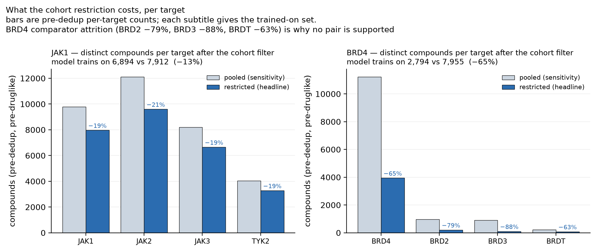

# Frozen results

Four evaluations, two targets, one revision of the pipeline. The cohort rules are versioned code and the
gate thresholds are identical across all four panels — both checkable from `medchem.cohorts`, `configs/`
and each manifest, which is why they are stated that way rather than as a claim about when they were
decided. Every metric quoted here is asserted against the records in
[`provenance/`](../provenance/) by `scripts/verify_docs_against_manifests.py`, which runs in CI, so a
number cannot drift from the record it came from without failing the build. That check covers the
NUMBERS. The prose around them — what a cohort means, what a limitation implies, what was and was not
run — is not machine-checkable and is not claimed to be; read it as argument, and the provenance records
as evidence.

## The four panels

Each target is evaluated twice: a **headline** cohort with one assay definition, and a **pooled
sensitivity** cohort admitting every IC50 assigned to the target. Both runs of a pair consumed the **same
raw inputs by construction, not by comparison**: the cohort is declared in `curation`, which is not part
of the hashed acquisition section, so a pair resolves to one `data_pull` cache key and therefore one
artifact set. The published manifests record that key and the artifacts' SHA-256s, and the two panels'
hashes are identical because they are hashes of the same files — which is a stronger guarantee than two
independent checksums agreeing, and a different one, so it is worth stating precisely. The only
difference between a pair is the declared cohort.

| | JAK1 headline | JAK1 sensitivity | BRD4 headline | BRD4 sensitivity |
|---|---|---|---|---|
| cohort | `biochemical_explicit` | `target_associated` | `domain1_bd1_explicit_structured_binding` | `target_associated` |
| assays admitted | 456 / 1,228 (37.1%) | 1,228 / 1,228 | 507 / 3,684 (13.8%) | 3,684 / 3,684 |
| IC50 records kept | 10,651 / 15,034 (70.9%) | 15,034 / 15,034 | 8,055 / 19,601 (41.1%) | 19,601 / 19,601 |
| curated rows | 23,081 | 27,512 | 3,036 | 9,805 |
| **compounds modelled** | **6,894** | 7,912 | **2,794** | 7,955 |
| drug-like subset | 5,097 | 5,952 | 2,150 | 5,767 |
| random-split R² | 0.789 | — | — | — |
| **scaffold-CV R²** *(gate ≥ 0.55)* | **0.7597** | 0.7407 | **0.7283** | 0.7523 |
| **temporal R²** *(2022)* | **−0.3621** | −0.1018 | **+0.0190** | +0.1295 |
| y-scramble R² *(gate ≤ 0.10)* | −0.1749 | −0.1290 | −0.1251 | −0.0787 |
| scaffold overlap — *random* split | 76.0% | 76.8% | 66.0% | 69.8% |
| scaffold overlap — *temporal* split | 6.7% | 12.1% | 5.0% | 9.6% |
| selectivity pairs supported | 3 / 3 | 3 / 3 | **0 / 3** | 2 / 3 |
| **gate** | pass | pass | pass | pass |

All four panels were executed at a **single clean revision** (`dirty: false`, recorded as
`code.single_clean_revision` in every manifest) against the same published snapshot, so they share one
release identity. Every panel was then re-run cache-free and compared, value by value, against artifacts
captured beforehand and held outside the repository: the largest continuous difference across all eight
compared records was **1.8 × 10⁻¹⁵** and the largest rank-statistic difference **4.7 × 10⁻⁷**, both far
inside the tolerances the README documents, with every support verdict, support reason, paired count,
supported-comparator list, basis column and production-model decision identical. Those are the decisions
the two compared artifacts carry; assay-level cohort exclusion reasons live in `run_manifest.json`, which
is not one of the eight, so this comparison does not speak to them.

**What that comparison does and does not establish.** It is a FINAL-ARTIFACT reproduction: the published
results are the ones a cache-free rerun of this source produces, within the stated bounds and with
identical decisions. It is not evidence about the spec-1.1 → 1.2 correction or the cohort key rename,
because the reference it compares against was captured *after* both, and a reference captured downstream
of a change cannot testify about that change.

The claim that the rename left inclusion semantics untouched rests on different evidence, which is
stronger and does not need a rerun: the two cohort definitions in `medchem.cohorts` are compared field by
field — `accept_labels`, `require_domain`, `exclude_labels` and the structured-field requirements are
byte-identical, only `description` and `display_name` differ — the old key resolves through
`COHORT_ALIASES` to the new one, and `tests/test_cohort.py` asserts both. That is a property of the rules,
checkable by reading them, rather than an inference from a rerun.

The random-split figure is shown once, for JAK1, purely to mark the size of the leakage it carries
(0.789 against 0.760 scaffold-CV, on a set with 76% scaffold overlap). It is not an honest headline for
any panel and is not used as one.

## Retrospective is not chronological

This is the central limitation, not a caveat to it.

- **Scaffold generalisation is strong on both target classes.** R² ≈ 0.75 whether the protein is a
  kinase or a bromodomain, using unchanged workflow logic.
- **Chronological generalisation is poor.** Train on pre-2022 labels only, test on 2022-onward: JAK1
  **−0.362**, worse than predicting the training mean. BRD4 **+0.019**, indistinguishable from nothing.
- The pooled cohorts do better temporally (−0.102, +0.130) and this is **not** evidence that pooling
  helps — see the confound below.

**Interpretation.** These models support computational prioritisation within represented chemical space.
They do not establish reliable prospective activity prediction. Anything the pipeline nominates is a
hypothesis for testing, and the temporal result is why.

Two properties qualify these numbers, and the first cuts the opposite way from how it is usually
assumed:

1. **Scaffold overlap belongs to the random split, not the temporal one.** The 66.0–76.8% figure in the
   table above is `leakage.test_scaffold_overlap_frac`, which the harness computes from the **random
   80/20** split — that is why the random split is not a headline. The **temporal** test sets share only
   **5.0–12.1%** of their scaffolds with training, so the chronological split is already close to
   scaffold-disjoint. The negative temporal R² therefore cannot be attributed to shared scaffolds, and
   the temporal split is the harder test rather than a flattered one. Derived by
   [`scripts/derive_temporal_overlap.py`](../scripts/derive_temporal_overlap.py) into
   `provenance/<panel>/temporal_overlap.json` and asserted by the documentation verifier.
2. **Label provenance.** Temporal figures use era-split labels (`pIC50_pre`), so training never sees a
   post-cutoff measurement. Every published report records
   `temporal_split.train_label_source = "pre-cutoff median"`, which is what makes the claim checkable
   rather than asserted; a label-provenance claim with no recorded source is not verifiable.

## What the cohort comparison shows, and what it cannot

Cohort restriction **improved** JAK1 scaffold-CV performance (0.741 → 0.760, on 13% fewer compounds) and
**reduced** BRD4's (0.752 → 0.728, on 65% fewer). Temporal performance was **lower** for JAK1 (−0.102 →
−0.362) and essentially unchanged for BRD4 (+0.130 → +0.019, both indistinguishable from nothing).

> This comparison **cannot isolate assay heterogeneity from changes in sample size, chemical space, or
> time distribution.** The headline and sensitivity runs differ in their training *and* their evaluation
> populations. The direction is observed; the cause is not established.

Claims that earlier drafts made and that are **withdrawn**: that cleaner labels beat more labels, and
that narrower cohorts extrapolate less. Both are stronger than this design supports.

## Why cohorts exist at all

A single-protein ChEMBL target is a mixture of assays that disagree. Derived from the published input
bytes by `scripts/derive_composition.py`:

| BRD4 assay label | % of assays | % of IC50 records | curated median pIC50 |
|---|---|---|---|
| first bromodomain | 19.1% | 47.7% | 6.26 |
| biochemical, no domain stated | 7.8% | 25.0% | 6.07 |
| cell-based | 58.8% | 15.8% | 6.51 |
| second bromodomain | 8.7% | 6.3% | 6.71 |
| unmatched | 5.2% | 5.1% | 6.58 |

The two denominators differ by more than 3× and answer different questions: cell-based assays are
numerous but small. Quoting one while implying the other is how an earlier draft reported "~5%
cell-based" for what is 15.8% of records and 58.8% of assays.

**Domain axis.** Apabetalone, a phase-3 BET inhibitor, reads **5.85** on the first bromodomain against
**6.88** on the second — 1.03 log units, same molecule, same protein. Cohort medians differ by
**0.45 log units** in the same direction (6.26 vs 6.71).

**Format axis.** JAK1 records are 70.5% biochemical and 25.0% cell-based, curated medians **7.75** and
**7.30** — a **0.45 log unit** difference.

> Read the format figures as **descriptive evidence that the cohorts differ**, and nothing more. They
> compare two population medians over two largely different compound sets. They do **not** show that
> assay format shifted any individual measurement, and they are not corrected for the chemistry, era or
> publication source that vary alongside format. Establishing a per-compound format effect would require
> the same molecules measured both ways, which this analysis does not do.

The direction is not even consistent across targets: JAK1's biochemical median is **higher** than its
cell-based one (+0.45), while BRD4's is **lower** (−0.44). "Cell-based reads weaker, so drop it" only
ever worked on JAK1. Formats are separated because they measure different things, not because one is
reliably weaker.

### The BRD4 headline cohort: BD1-explicit, structured single-protein binding IC50

The cohort key is `domain1_bd1_explicit_structured_binding` (cohort spec **1.2**). It was renamed
from `domain1_biochemical_confirmed`, which asserted that ChEMBL's structured fields confirmed the
BD1 **domain**; they confirm the assay **format**. The old key remains as a deprecated alias and
selects identically — every accept/exclude rule and structured requirement is unchanged. Its four conditions come from
**two different kinds of evidence**, and the distinction matters:

| condition | source | what it establishes |
|---|---|---|
| description names the first bromodomain | assay **description** | domain identity — from TEXT, not confirmed independently |
| description names **no** tandem-domain construct | assay **description** | the construct is not a both-domains chimera |
| `bao_format` is a single-protein format | **structured field** | the measurement is on isolated protein, not cells |
| `assay_type` is a binding assay | **structured field** | it is a binding measurement |

**ChEMBL's structured fields do not encode which bromodomain was measured.** So the structured fields
confirm the *assay format*; the *domain* is still read from free text. "Structurally-confirmed BD1" would
overstate that, which is why the cohort is described as BD1-explicit **with** a structured
single-protein binding format, rather than as a structurally-confirmed domain.

Anything ambiguous or conflicting is **excluded with a recorded reason**, and `select_assays` raises
rather than proceeding if the structured fields are unavailable — a silent fallback to a text-only
decision would be invisible in the results, because the run would simply admit more assays.

**This replaced two earlier definitions that were both wrong.** Spec 1.0 named the cohort
"biochemical-explicit" and confirmed nothing. Spec 1.1 renamed it honestly but kept the text-only rule,
and an audit of the structured fields showed what that admitted:

| admitted in error | assays | IC50 records | why |
|---|---|---|---|
| tandem-domain constructs | 23 | 690 | `BD1/BD2` contains `BD1`, and the domain-1 rule is evaluated first, so a both-domains construct was labelled first-bromodomain. **15 of the 23 carry otherwise-clean structured metadata**, so no structured check alone would have caught them |
| ambiguous BAO format | 172 | 608 | `BAO_0000019` is the *root* "assay format" term; it asserts nothing about biochemical versus cellular |
| conflicting `assay_type` | 1 | 0 | type A against a binding cohort |
| cell-based BAO format | 1 | 0 | a HUVEC dual-luciferase reporter assay |

The correction cost 197 assays and 1,298 records, and the admitted set is a strict **subset** of the
previous one — verified, not assumed.

**It changed a conclusion**, and that is the point of making it. Under the text-only spec-1.1 rule the
BRD4–BRD2 pair was *supported* and a production selectivity model was written from BRD2. Under spec 1.2 no
BET pair is supported and no model is written. The apparent support came from measurements a
domain-resolved cohort does not admit.

The superseded spec-1.1 metrics are omitted because their corresponding provenance was not retained; only
the verified spec-1.2 values are reported. The direction of the change is a statement about the rules and
remains reproducible: `medchem.cohorts` still defines the spec-1.1 cohort as
`domain1_noncellular_explicit`, so running the BRD4 panel under it recomputes the superseded figures.
Retrospective potency clears the gate under both. A data-quality correction that leaves every number
untouched teaches nothing about the data; this one did not.

No gate, seed, feature or hyperparameter changed: the two gate thresholds are identical across all four
shipped configs and identical on both sides of this correction, which is checkable from `configs/` and
from the `gates` block of each published manifest. Nothing is claimed about the ORDER in which the work
happened: no published record can attest to that, so the identity of the thresholds is what is stated.

## Negative control

The y-scramble null **passed on all four runs**: −0.175 to −0.079 against observed values of 0.73–0.76.

A value near zero is the expected outcome for a working control. A less-negative value is **not** weaker
evidence than a more-negative one. The limitation here is the design, not the value: it is a **single permutation**, so no
empirical p-value and no uncertainty on the null was estimated. A permutation distribution would be a
strict improvement and was not run.

## Selectivity

Direct Δ-potency models, scaffold-grouped cross-validation, one model per pair. A pair is **supported**
only if its bootstrap R² interval excludes zero.

| pair | cohort | n | R² | 95% CI | verdict |
|---|---|---|---|---|---|
| JAK1–JAK2 | biochemical | 5,805 | 0.772 | [0.754, 0.789] | supported |
| JAK1–JAK3 | biochemical | 2,973 | 0.794 | [0.777, 0.810] | supported |
| JAK1–TYK2 | biochemical | 2,482 | 0.843 | [0.823, 0.860] | supported |
| BRD4–BRD2 | BD1-explicit, structured single-protein binding IC50 | 80 | +0.142 | [−0.075, 0.277] | **spans zero** |
| BRD4–BRD3 | BD1-explicit, structured single-protein binding IC50 | 56 | +0.102 | [−0.141, 0.269] | **spans zero** |
| BRD4–BRDT | BD1-explicit, structured single-protein binding IC50 | 54 | −0.026 | [−0.210, 0.200] | **spans zero** |

**In the headline BD1-explicit, structured single-protein binding IC50 cohort, no BET pair is supported, so no
selectivity model was written for it.** The pooled sensitivity cohort supports 2 of 3 pairs and does
write a model. `production_model.written: false`, and
the screening and generative stages take their optional-selectivity path rather than scoring against
noise. The pipeline producing nothing here is the correct behaviour, not a missing result.

The reason is visible in the attrition: BD1-explicit structured-binding matching costs the comparators 79% (BRD2), 88%
(BRD3) and 63% (BRDT) of their compounds, leaving panels of 80, 56 and 54 paired measurements.



**"Supported" means a positive but uncertain cross-validated estimate.** The intervals resample fixed
out-of-fold predictions without refitting and ignore scaffold-group dependence, so they are optimistic
about their own width. In the pooled sensitivity cohort two pairs qualify (BRD2, BRD3) — but with
positive classes of 2.2% (17/776) and 1.4% (11/803), where classification metrics are unstable. That
result belongs to the sensitivity analysis only; its primary side mixes domains and assay formats.

## Gates

Identical across all four panels, by construction: a cohort change must not be rewarded with a looser
bar, or "the restricted cohort passes" becomes unfalsifiable.

| gate | threshold | JAK1 hl | JAK1 sens | BRD4 hl | BRD4 sens |
|---|---|---|---|---|---|
| scaffold-CV R² | ≥ 0.55 | 0.7597 ✓ | 0.7407 ✓ | 0.7283 ✓ | 0.7523 ✓ |
| y-scramble R² | ≤ 0.10 | −0.1749 ✓ | −0.1290 ✓ | −0.1251 ✓ | −0.0787 ✓ |

Both gates hold the same threshold in all four configs, and the same thresholds before and after the
cohort correction — which is what a reader can verify, from `configs/` and from each manifest's `gates`
block. Again nothing is claimed about when a threshold was decided, only that it is the same threshold
everywhere. The temporal split
has **no** gate, and that is deliberate: it is reported as a finding, not scored as a pass.

## Provenance

Per panel, `provenance/<panel>/run_manifest.json` records the SHA256 of all 8 raw inputs, the cohort name
and spec version, the exact admitted and excluded assay IDs with exclusion reasons, attrition at every
step (assays, activities and compounds separately), the gates, and the environment.

Raw inputs are resolved from the pipeline's own `data_pull` cache key rather than by directory search. An
earlier version globbed for `*_raw.csv` and recorded whichever candidate sorted last, which pointed at a
stale pull output lacking assay identity — the metrics were unaffected, but the record could not have
reproduced them.

The published snapshots in [`data/frozen_snapshots/`](../data/frozen_snapshots/) are those exact inputs,
so the metrics above can be recomputed from the same bytes rather than re-derived against a moving
database, under the environment and tolerance documented in the README. What is pinned is the
**bytes**, by checksum — not a ChEMBL release label. The REST query cannot pin a release and the
served release was never confirmed; see [DATA_CARD.md](DATA_CARD.md):

```bash
MEDCHEM_FROZEN_SNAPSHOT=data/frozen_snapshots uv run medchem run -p discovery -c configs/brd4.yaml \
  --stage data_pull --stage curate --stage featurize \
  --stage qsar --stage selectivity --stage evaluate
```

Provenance identities are kept separate in [`provenance/IDENTITY.json`](../provenance/IDENTITY.json),
because no single git SHA identifies both the source that produced a result and the tree that ships it:
the **scientific-source digest**, which is recomputable from this tree; a Boolean attestation that all
four panels ran at one clean revision (`code.single_clean_revision`) rather than any revision identifier;
the commit holding the content; the tag applied to it; and the manifest tool version.

## Conclusion

The same workflow executed across both target classes — a kinase and a bromodomain — using unchanged
workflow logic and identical evaluation gates. Retrospective potency models were strong across both target classes and
survived a fail-closed tightening of the assay cohort. Temporal and selectivity analyses exposed
important limitations in prospective generalisation and in the support public data provides — most
sharply in the BET family, where no selectivity pair survives the BD1-explicit, structured single-protein binding IC50 cohort.
No candidate set is shipped in this release; what the pipeline emits would be computational priorities for
experimental testing, not validated hits.
